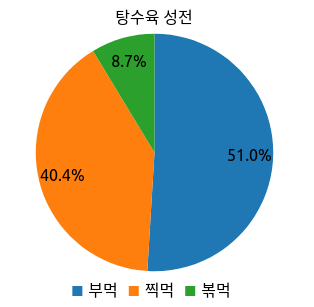

# Billboard.js with React

React.js 앱에 차트 표현을 위해 Billboard.js 를 사용하는방법을 간단하게 알아보고

사용해보면서 겪은 시행착오나 느낌에 대해 이야기 해보려고 합니다.

이 포스팅에서 작성된 예제코드는 [Github repo](https://github.com/noizbuster/post-examples/tree/master/billboard-with-react) 에서 확인 할 수 있습니다.

### Environment
* Ubuntu 18.04
* node.js v14.x (LTS)
* react.js v17.x

# How to

### Prerequisites
* node.js
* react.js

## 준비 및 설정

### 프로젝트 준비

> 이미 사용하고 있는 프로젝트가 있다면 생략하셔도 됩니다.

```bash
npx create-react-app billboard-with-react
```

### 의존성 설치
```bash
npm install --save billboard.js lodash
```

### 차트를 그릴 위치 정하기
```javascript
// ./src/App.jsx
import React from 'react';
import './App.css';

function App() {
    // 1. billboard가 element 를 찾는데 사용할 reference 를 만들어줍니다.
    const myChartRef = React.useRef(null);

    ...

    return (
        <div className="App">
            {/* 2. 레퍼런스를 차트를 그릴곳에 지정해줍니다. */}
            <div ref={myChartRef} />
        </div>
    );
}

export default App;
```

### 차트 작성

저의 경우 간단한 클래스를 만들어서 작성했지만 chart 를 파라미터로 받는 함수들의 집합을 사용하는것이 오히려 적합한 상황도 있습니다.
꼭 아래와 같이 만들 필요는 없으며 상황에 맞게 작성하시면 됩니다.


#### billboard.js 헬퍼 (optional)
이 예제의 경우에 최초 한번만 차트를 생성하고 이후에는 update 하여 차트가 깜빡이지 않도록 처리했습니다.
업데이트가 될일이 없다거나 하는 경우에는 이런 유틸리티가 필요없을수 있습니다.

```javascript
// ./src/utils/billboardHelper.js
import * as _ from 'lodash';
import bb, {Chart} from 'billboard.js';

/**
 * @param {MutableRefObject} ref
 * @return {Chart}
 */
export function findChartByRef(ref) {
    return _.find(bb.instance, (i) => _.get(i, '$.chart._groups[0][0]') === ref.current);
}

...

```

billboard 에서 생성된 차트들은 `bb.instance` 안에서 관리됩니다.  
react 에서는 `MutableRefObject` 로 차트를 관리 할것이기 때문에 이것을 가지고 우리가 제어할 차트를 다시 찾아 올 수 있습니다.

#### 차트 작성
앞서 언급했던것처럼 꼭 이대로 작성 할 필요없습니다.(값의 갱신이 매우 빠르다면 비효율적일수 있습니다.)  
경험상 create, update 를 분리해서 관리하는게 조금 더 편리하고 화면이 깜빡거리지 않게 관리하는데 도움이 되었습니다.
```javascript
// ./src/charts/MyPieChart.js
import bb, {pie, Chart} from 'billboard.js';
import {findChartByRef, jsonToColumns} from '../utils/billboardHelper';

export default class MyPieChart {
    chartRef;
    chart;

    /**
     * @param {MutableRefObject} chartRef
     */
    constructor(chartRef) {
        this.chartRef = chartRef;
        this.chart = findChartByRef(this.chartRef);
    }

    /**
     * 기존에 생성된 차트가 있으면 update 를 하고, 아니면 생성도 해 줍니다.
     * @param {PIE_DATA_COLUMNS}  data
     */
    render(data) {
        if (!this.chart) {
            this.create();
        }
        this.update(data);
    }

    /**
     * 차트를 새로 그립니다.
     * @return {Chart}
     */
    create() {
        const chartOptions = {
            title: {text: '탕수육 성전'},
            data: {
                columns: [
                    ['pour', 50],
                    ['deep', 40],
                    ['fry', 5],
                ],
                names: {
                    pour: '부먹',
                    deep: '찍먹',
                    fry: '볶먹',
                },
                type: pie(),
            },
            bindto: this.chartRef.current,
        };

        this.chart = bb.generate(chartOptions);
        return this.chart;
    }

    /**
     * 차트의 내용물을 업데이트 합니다.
     * @param {PIE_DATA_COLUMNS} data
     * @return {Chart}
     */
    update(data) {
        if (this.chart) {
            this.chart.load({columns: data});
            this.chart.resize();
        }
    }

    /**
     * 차트에 입력된 데이터를 가공합니다.
     * @param {PIE_DATA_JSON}    jsonData
     * @return {PIE_DATA_COLUMNS}
     */
    static forgeData(jsonData) {
        return jsonToColumns(jsonData);
    }
}
```

차트를 처음 그릴때 `bindto: this.chartRef.current` 로 `React.useRef()` 로만들어진 레퍼런스를 넘겨주기만 하면 됩니다.

만약 차트의 config 를 고칠일이 있다면 update 에서 처리하는게 적합합니다.

간혹 `Chart.config()` 로 제어를 할 수 없는 항목들이 있습니다. title 같은것들이었는데요, 이런경우

1. [load 의 done](https://naver.github.io/billboard.js/release/latest/doc/Chart.html#load) 에서 직접 접근해서 DOM 변경
1. 변경 할 항목들을 가지고 Chart 를 아예 다시 생성
1. Chart 밖으로 꺼내서 다른 방식으로 보여주기

와 같은 방법으로 해결 할 수 있습니다.


#### 차트를 랜더링 할 수 있도록 호출
```javascript
// ./src/App.jsx
import React from 'react';
import MyPieChart from './charts/MyPieChart';
import './App.css';

function App() {
    const myChartRef = React.useRef(null);
    const [pieData, setPieData] = React.useState({pour: 50, deep: 40, fry: 5});

    // 차트가 업데이트 되는것을 보고 싶어서 2초마다 값이 조금씩 증가하게 만들었습니다.
    React.useEffect(() => {
        setTimeout(() => {
            console.log('data updated from', pieData);
            setPieData({
                pour: pieData.pour + 1.5,
                deep: pieData.deep + 1,
                fry: pieData.fry + 2,
            });
        }, 2000);

        // 이부분에서 실재로 차트의 랜더링을 발생시킵니다.
        const myPie = new MyPieChart(myChartRef);
        myPie.render(MyPieChart.forgeData(pieData));
    }, [pieData]);

    return (
        <div className="App">
            <div ref={myChartRef} />
        </div>
    );
}

export default App;
```

#### 완성


[예제: Github repo](https://github.com/noizbuster/post-examples/tree/master/billboard-with-react)

## 후기

### 장점

Billboard.js 는 많은 부분 자동으로 처리해주는 부분이 많아서 쉽게 배워서 사용 할 수 있는 차트 라이브러리입니다.  
간단한 차트를 빠르게 구현해서 보고 싶을때 적합합니다.  

프로젝트가 잘 관리가 되고 있는것으로 보입니다. 질문등이 올라오면 잘 답장을 해주십니다.

React 에서 사용할때 불편함이 없었습니다.

### 시행착오

#### 견고? 경직?

정해져있는 크기와 일반적인 길이의 텍스트들이 legend 나 axis label 에 보여질때는 손대지 않아도 잘 그려줍니다.  
대신, 거의 모든 텍스트들이 여러줄이 된다거나 위치를 조정하고 싶다면 이때부터는 매우 불편해집니다.  
일반적인 요구조건이라면 문제가 없어서 시작은 쉽지만 커스터마이징은 다소 불편한면이 있습니다.

#### 문서도 예제도 있지만 헤멜수 있습니다.

생각보다 billboard.js 에서 제공하는 예제와 문서에 모든 디테일들이 있지 않습니다.
있는 기능이지만 예제와 문서에 명시가 되어있지 않다거나, 존재하는 제약사항임에도 API 문서에서 경고하고 있지 않습니다.

일례로, 다른차트와는 다르게 Pie나 Donut 차트에서는 json 데이터를 사용하지 못하여 무조건 columns 로 변환해주어야 합니다.  
하지만 json 으로 값을 넣었을경우에는 axis 를 파싱하는데 실패한것과 같은 에러로그만 볼 수 있어서 무엇이 문제인지 파악하기가 어려웠습니다.  
결국 github 에 있는 issue 에서 다른분들이 주고받은 대화를 통해 load({json:{}) 형태로 데이터를 사용 할 수 없다는걸 알 수 있었습니다.  

때때로 코드를 읽어야 문제를 해결 할 수 있는 경우도 있었습니다. (코드가 많지는 않아서 읽지 못할분량은 아니였어요).

## 마치며

바쁜데 친절한 동아리 선배같은 느낌의 라이브러리였습니다.

가끔씩 골탕을 먹긴 하지만 전반적으로는 사용하기 편리해서 계속 사용할 의향이 있습니다.

다만 매우 복잡하거나 작은곳에 높은 밀도로 정보를 보여줘야 하는 경우에는 좀 더 저수준의 라이브러리를 이용할것 같습니다.

> 잘못된 부분이나 궁금한점 있으면 알려주셔요 힘 닿는데까지 함께 고민해보겠습니다.
