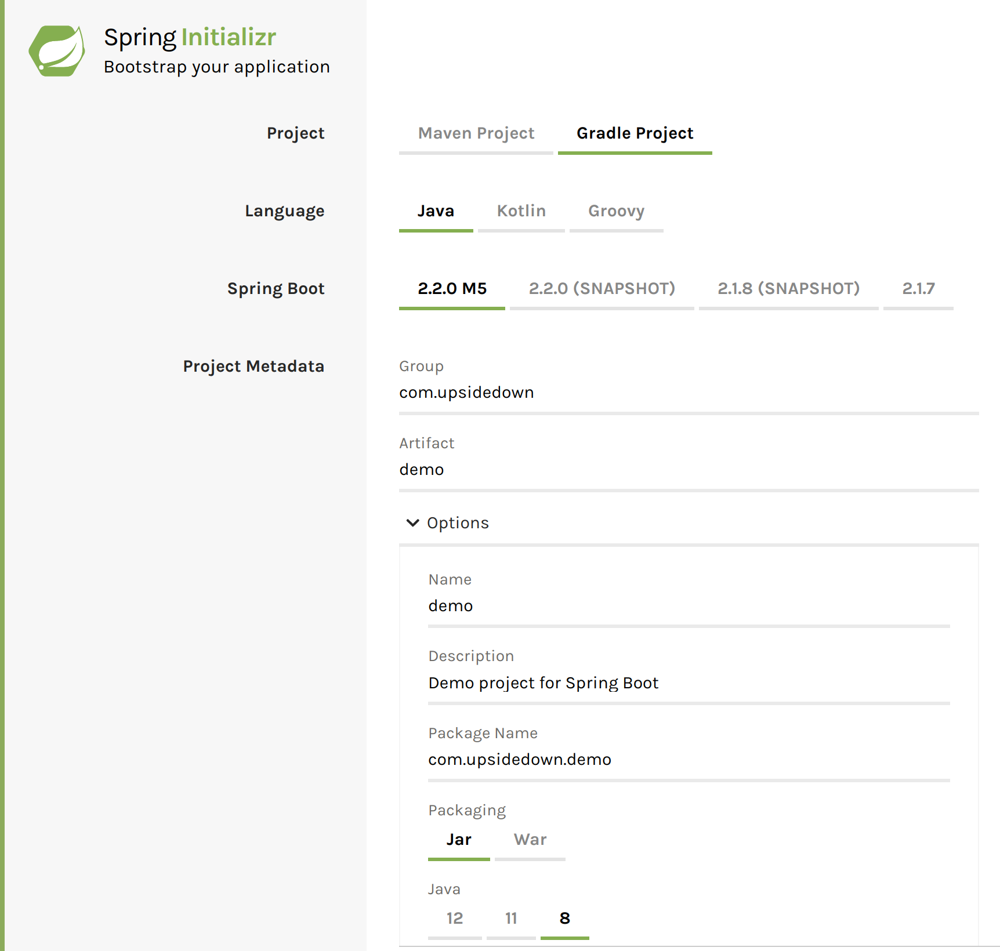
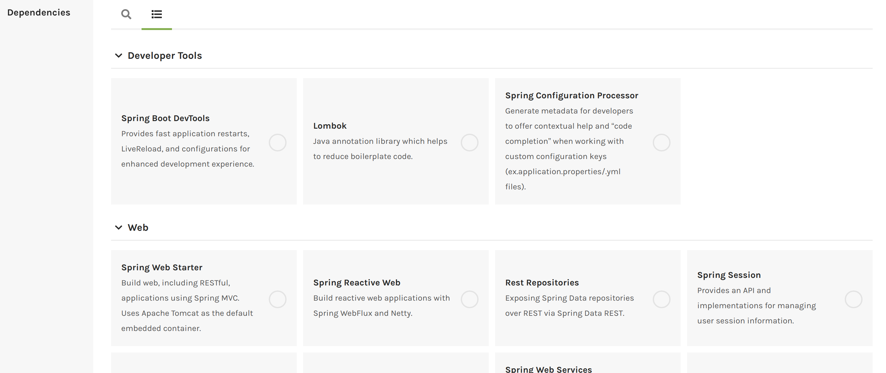

# Boiler Plating

spring.io 의 추천대로 [start.spring.io](start.spring.io) 에서 프로젝트를 생성하는것을 해보려고 한다.



이런 광경이 보인다. 예전에 유행했던 MegaBoilerpate 가 생각나는것은 왜일까?  
artifectId 을 작성하는 convention이 있는지 찾아보니 `-` 과 소문자를 이용해서 짓는게 일반적인것으로 보였다.  
여기까지는 설정이 어려워보이지 않았다.  

그런데...



어? 추가 기능을 넣을수 있는게 있구나? 근데 많아도 너무 많다.  
이중에서 내가 필요한것이 무엇인지 어떻게 구분하지?

지금 알아보기엔 너무 많으니 필요한것 위주로 찾아서 차근차근 읽어보도록 해야겠다.  
그것보다, 나중에 이것들이 추가로 필요해졌을때 쉽게 추가 할 수 있는지가 먼저 궁금해졌다.

일단 시험삼아 내멋대로 디펜던시를 몇개 골라서 프로젝트를 만들어봐야겠다.

* Web
  * Spring Web Starter
  * Spring Reactive Web
* Security
  * OAuth2 Resource Server (요거를 나중에 추가해보도록 하자)
* NoSQL
  * Spring Data Reactive MongoDB
* Ops
  * Spring Boot Actuator (이게 그렇게 좋다던데)

만들어진 보일러플레이트를 열고 돌려보니 mongodb 커넥션을 못만들었다고 에러를 낸다.
docker 로 기본포트로 열려있는 도커 컨테이너를 하나 띄우니 해결되었다.


## 디렉토리 구조 파악

```
├── build/          - Build 된 결과물이 저장되는 디렉토리
├── build.gradle    - Gradle 의 빌드 설정을 저장, node 의 package.json 과 유사한?
├── settings.gradle - gradle 자체에 대한 설정파일
├── gradle/         - gradle 을 알아서 받아서 세팅하는 스크립트 등이 들어있음.
├── gradlew         - Gradle startup script for UN*X
├── gradlew.bat     - Gradle startup script for Windows
├── HELP.md         - 기본으로 생성된 도움말 파일
└── src             - 소스코드들
    ├── main
    │   ├── java
    │   │   └── io
    │   │       └── upsidedown
    │   │           └── punchcardapi    - 애플리케이션
    │   │               └── PunchCardApiApplication.java
    │   └── resources
    │       ├── application.properties
    │       ├── static
    │       └── templates
    └── test        - 테스트코드들
        └── java
            └── io
                └── upsidedown
                    └── punchcardapi
                        └── PunchCardApiApplicationTests.java

```

디펜던시들을 교차해가면서 선택해서 보일러플레이트를 만든다음 meld 로 간단하게 비교해 보면 디펜던시를 관리하기 위해 필요한 변경은 대부분 build.gradle 파일을 업데이트 하는것으로 이루어 진다. 디테일한 부분은 모두 spring boot 가 숨겨주는모양.
외부 설정은 `main.resources.application.properties` 에서 관리된다.

## 내가 추가할 디렉토리구조는 어떤식으로 배치하지?
arpit khandelwal 이 만들어둔 [springboot-starterkit](https://github.com/khandelwal-arpit/springboot-starterkit) 프로젝트를 참고하자면 `PunchCardApiApplication.java` 가 위치하는 디렉토리를 거점으로 디렉토리를 확장해나가면 되면 괜찮아보인다.

아래와 같은 디렉토리가 경우에 따라 필요해질 수 있다고 보여진다.

* config
* controller
* dto
* exceptionupdated
* model
* repository
* security
* servicesubmissions
* util


# references
* [Spring Initializr](https://start.spring.io)
* https://spring.io/guides/tutorials/react-and-spring-data-rest/
* https://spring.io/guides/gs/actuator-service/
* https://spring.io/guides/gs/rest-service/
* [Arpit Khandelwal - Spring Boot 2.0 — Project Structure and Best Practices](https://medium.com/the-resonant-web/spring-boot-2-0-starter-kit-part-1-23ddff0c7da2)
* [springboot-starterkit](https://github.com/khandelwal-arpit/springboot-starterkit) 