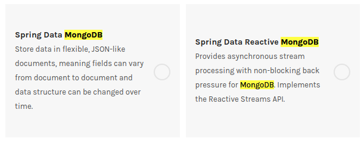
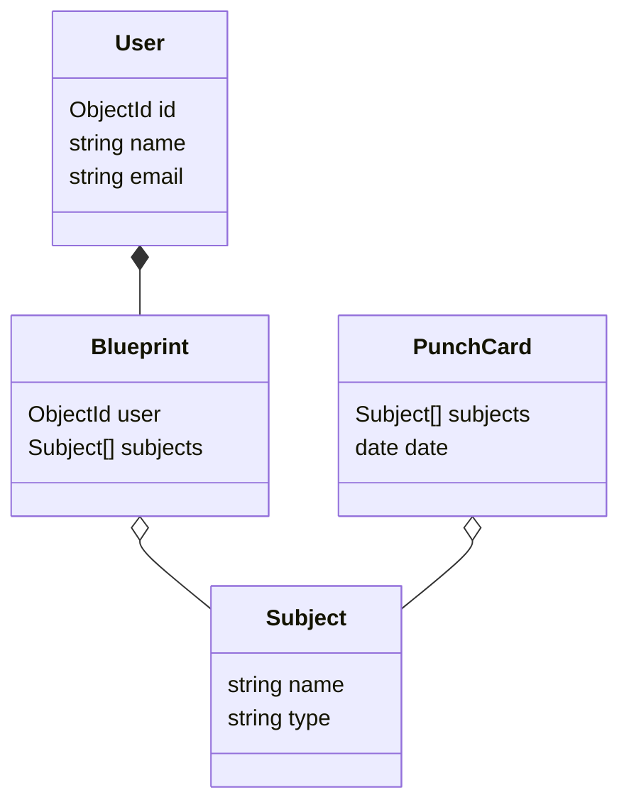

# 데이터를 읽고쓰자

## MongoDB 를 사용하기위한 의존성 추가하기

start.spring.io 에서 MongoDB 와 관련된 Dependency 들을 보는데 여러개가 보인다.


이밖에도 `Embedded MongoDB database` 도 있지만 딱봐도 이건 내 관심사가 아니니까 패스해도 될거 같다.  
짧은 설명으로는 reactive 가 붙은놈은 비동기방식으로 처리가 되는놈인거 같다. 이걸로 선택하기로 한다.

build.gradle 파일의 dependencies 오브젝트 안에

```gradle
implementation 'org.springframework.boot:spring-boot-starter-data-mongodb-reactive'
```
가 추가되어있는것을 볼 수 있다.

`HELP.md` 파일에 적힌 [링크](https://docs.spring.io/spring-boot/docs/2.2.x/reference/htmlsingle/#boot-features-mongodb)를 타고 들어가면 reactive 가 붙은거랑 안붙은거랑 문서의 같은섹션을 참조하고 있다. 아마도 대동소이한가보다.

바라보고있는 MongoDB 의 database 를 바꿔주기위해 main.resources/application.properties 에 아래를 추가해준다.  
DB에 크레덴셜도 없고 로컬호스트를 보고있게 되어있으니 일단 devel 서픽스를 붙여놓자.
```java
spring.data.mongodb.uri=mongodb://localhost:27017/punch_card_devel
```

설명을 더 읽어보면 `MongoTemplate` `Spring Data MongoDB Repositories` 등에 대해서 이야기 하고 있는데 `MongoTemplate` 는 JDBC 의 그것과 비교하고 있어서 무슨말인지 알수가 없고 `Spring Data MongoDB Repositories` 의 경우는 정의된 메서드 이름에 따라 쿼리를 자동으로 생성해주는놈으로 이해했다.

모델을 정의하고 이것을 RESTful 인터페이스까지 매핑하는것에대한 정보는 부족해서 좀 더 찾아보았다.

## 데이터 모델링 (draft)
뭐라도 있어야 코딩을 해볼테니 아주 간단하게 사용할 데이터 모델을 약식으로 만들어 보자.



## 구현

### MongoDB Model & Repository

굳이 Express.js 와 Mongoose 에 대응해서 비교를 해보자면 `Repository` 가 Mongoose 의 model 역할을 하고 인자로 집어넣은 Model 이 Schema 역할을 해준다.

reactive 를 사용하고 안하고의 차이는 비동기처리를 Flux를 통해서 해주는데 RxJava 와 비슷한 방식으로 보인다.

Repository를 만듬에 있어서 예제에서처럼 필요한 함수를 매번 만들어줄 필요가 없었다.  
기존에 생성되는 함수의 용도나 내부 구현을 바꾸고 싶거나 할때 추가해서 재구현을 하는 느낌이다. 예를들어 비밀번호의 경우 업데이트 할 때 내용을 hashing 해서 넘겨줘야 할텐데 이런작업을 여기다가 구현하면 되는거 같다.

#### Model
모델은 이런식으로 만들었다. MongoDB 에서 사용하는 데이터 타입을 명시하기 위해서 필요한것 이외에는 별다른 의존성은 없다.
lombok 으로 getters, setters 를 자동생성 해주었다.
```java
package io.upsidedown.punchcardapi.model;

import lombok.Getter;
...
import java.util.Set;

@Getter
@Setter
@NoArgsConstructor
@Accessors(chain = true)
@Document(collection = "users")
public class UserModel {
    @Id
    private String id;

    @Indexed(unique = true, direction = IndexDirection.DESCENDING, dropDups = true)
    private String email;

    private String password;

    private String name;

}
```

#### Repository

레포지터리는 아래와 같이 만들었다. 비밀번호 관련해서는 작업을 추후에 해줄생각이고
일단은 동작 자체를 확인해보는게 중요하니 이렇게만 만들어두자.
```java
package io.upsidedown.punchcardapi.repository;

import io.upsidedown.punchcardapi.model.UserModel;
import org.springframework.data.mongodb.repository.ReactiveMongoRepository;
import org.springframework.stereotype.Repository;

@Repository
public interface UserRepository extends ReactiveMongoRepository<UserModel, String> {

}
```
# References

* [boot-features-mongodb](https://docs.spring.io/spring-boot/docs/2.2.x/reference/htmlsingle/#boot-features-mongodb)
* [creating-a-reactive-restful-web-service-using-spri-1](https://dzone.com/articles/creating-a-reactive-restful-web-service-using-spri-1)
* [reactive-rest-apis-spring-webflux-reactive-mongo](https://www.callicoder.com/reactive-rest-apis-spring-webflux-reactive-mongo/)
