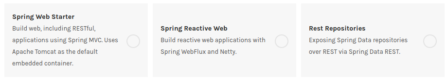

# RESTful API 를 구현하자
MongoDB 작업을 했지만 이것이 RESTful API 로 서빙되게 만드는것은 별개 문제다.  
Authentication, Authorization 등은 일단 나중에 생각하기로 하고 routing 을 우선 어떤식으로 하는지부터 알아보자.

## RESTful API 를 위한 의존성 설정


* Spring Web Starter - 전통적인 방식의 웹서버를 만드는 방법인것 같다.
* Spring Reactive Web - 비동기처리를 지원하는 방식인것 같다. MongoDB 도 리엑티브로 사용하고 있으니 이걸 사용해보도록 한다.
* Rest Repositories - Repository 를 바로 API 에 바인딩 하는 방식인것 같은데. 잠깐 적용해서 써보니 내 입맛대로 바꾸기에는 이건 너무 과한것 같아서 일단 패스하기로 했다.

`build.gradle` 파일 의 dependencies 안에 아래 설정값을 넣어주면 된다.  
```gradle
implementation 'org.springframework.boot:spring-boot-starter-webflux'
```

## Rest Controller

시행착오를 좀 거쳐서 아래와 같은 컨트롤러를 만들었다.
Express 로 치면 router 를 만든것인데 @RequestMapping 을 이용하면 공통된 path 를 밖에다 끄집어서 적어놓을 수 있다.
파라미터를 받는것도 {id} 와 같은식으로 path에 적어놓으면 @PathVariable 을 이용해서 함수에 인자로 넘겨받을 수 있게 되어있다.
```java
package io.upsidedown.punchcardapi.controller;

import io.upsidedown.punchcardapi.model.UserModel;
import io.upsidedown.punchcardapi.repository.UserRepository;
...
import reactor.core.publisher.Mono;

@RequestMapping("/users")
@RestController
public class UserController {

    @Autowired
    private UserRepository userRepository;

    @GetMapping()
    public Flux<UserModel> getAllUsers() {
        return userRepository.findAll();
    }

    @GetMapping("{id}")
    public Mono<ResponseEntity<UserModel>> getTweetById(@PathVariable(value = "id") String userId) {
        return userRepository.findById(userId)
                .map(savedUser -> ResponseEntity.ok(savedUser))
                .defaultIfEmpty(ResponseEntity.notFound().build());
    }
}
```

우선은 GET 메서드만 만들어서 코드에 접근이 되는지 정도만 확인을 해 보았다.  
이제 대충의 뼈대는 잡은것 같고 이후부터는 비지니스로직을 짜면서 살을 입혀보면 될것 같다.


# References

* [spring.io/guides/gs/reactive-rest-service/](https://spring.io/guides/gs/reactive-rest-service/)
* [spring-requestmapping-requestparam-pathvariable-example](https://www.journaldev.com/3358/spring-requestmapping-requestparam-pathvariable-example)
* [zetcode - GetMapping Tutorial](http://zetcode.com/spring/getmapping/)
* [spring-webflux-reactive-rest-api-demo](https://github.com/callicoder/spring-webflux-reactive-rest-api-demo)
* [reactive-rest-apis-spring-webflux-reactive-mongo](https://www.callicoder.com/reactive-rest-apis-spring-webflux-reactive-mongo/)
* [dzone - creating-a-reactive-restful-web-service-using-spri-1](https://dzone.com/articles/creating-a-reactive-restful-web-service-using-spri-1)
