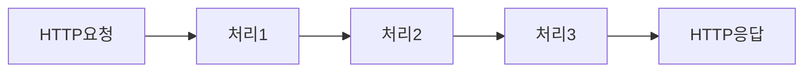

# 실전 Express!

Express.js 의 5.x 알파버전이 공개되었습니다. Async Router 등의 기능때문에 많이 기대하고 있었는데요. 이 기회를 빌어 Node.js 백엔드에서 가장 많이 사용되는 프레임워크인 Express.js 에 대해 소개하고 실전에서 얻은 경험을 공유해보기 위해 강의를 연재해보려고 합니다.

## Express.js 의 간단한 소개

Express.js 는 여러겹의 middleware로 구성 할 수 있는 Web Framework 입니다.

좀 더 간단하게 설명해보자면

이와같이 HTTP 요청을 일련된 단계를 거쳐서 응답을 만들어냅니다.

로그를 찍거나, 데이터를 가져오거나, 페이지를 렌더링 하는것들이 모두 middleware 로 구현될 수 있습니다.

개발자의 관점에서 Express.js 는 매우 간단하고 직관적인 구조를 가지고 있기 때문에 배우기 쉬울뿐만아니라 기능의 확장도 아주 유연합니다.

---

# 강의계획

## 대상

Express.js의 튜토리얼을 마친 상태의 Express.js 유저

## 개발환경

* Node.js v10.16.2   (Latest LTS: Dubnium)
  * 예제 코드들은 CommonJS로 작성됩니다.
* Express.js Version 5.x
  * 글을 쓰는 시점에서 5.x 버전이 알파상태입니다.
* Ubuntu 18.04
  * 다른 운영체제를 사용하더라도 아마 이 강의를 이해하는데 큰 문제가 없을것입니다.
* git

## 다룰 내용

이 강의에선 간단하게 RESTful API 서버개발을 위주로 설명을 하도록 하겠습니다.

여기에 이야기된것 이외의 부분에서 다루었으면 하는 내용이 있다면 코멘트나 이메일을 주세요. 여유가 된다면 이번 시리즈나 다음번 글에서 다뤄보도록 하겠습니다.

## 목차
1. 프로젝트 시작, Boilerplating
2. CORS, Middleware
3. 설정, Configuration
4. 로깅, Logging
5. 비동기 라우터, Async Router
6. 글로벌 에러 핸들러, Global Error Handler
7. 테스팅, Testing
8. 기술문서생성, Documentation
9. 도커를 이용한 배포, Deployment with Docker
   * Configuration

## 목차 (w/설명)

1. 프로젝트 시작, Boilerplating
   * Express 프로젝트를 만들고 각종 세팅을 합니다.
2. CORS, Middleware (Optional)
   * 주로 많이들 쓰는 미들웨어들을 소개하고 세팅합니다. 만약 필요하지 않다면 넘어가도 좋습니다.
3. 설정, Configuration
   * Development, Test, Production 별로 다른 설정을 사용하기 위한 설정파일을 세팅하고 다룹니다.
4. 로깅, Logging
   * 서버를 작성하면서 필요한 로그를 남기는 방법에 대해 설명합니다.
5. 비동기 라우터, Async Router
   * 비동기 함수로 만들어진 라우터를 작성하기 위해 필요한 추가적인 내용들을 다룹니다.
6. 글로벌 에러 핸들러, Global Error Handler
   * 에러를 핸들링하는 여러가지 방법에 대해 알아보고 미처 처리하지 못한 예외나 에러를 다루는 방법에 대해 알아봅니다.
7. 테스팅, Testing
   * 서버를 테스팅하는 방법에 대해 간단하게 알아보도록 합니다.
   * ava 를 사용할것입니다.
8. 기술문서생성, Documentation
   * RESTful API Spec을 공유하고 문서화를 자동화해주는 방법에 대해서 다룹니다.
9.  도커를 이용한 배포, Deployment with Docker
   * 서버를 Docker 로 배포하기 위해 필요한 작업들에 대해 다룹니다.
   * multi stage image build

