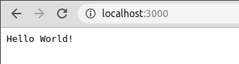

# Express.js 프로젝트 만들기

## 사전준비

* Node.js - [Node.js 제대로 설치하기](/ko/series/nodejs/nodejs-basic/001-install-nodejs/) 참고
* Git

## git, npm 초기화

```bash
# 디렉토리를 하나 만들고
> mkdir lecture-express-in-practice
> cd lecture-express-in-practice

# git 초기화
> git init

# npm 초기화
> npm init

package name: (lecture-express-in-practice) 
version: (1.0.0) 0.0.0
description: 
entry point: (index.js) 
test command: 
git repository: https://github.com/noizbuster/lecture-express-in-practice.git
keywords: 
author: NoizBuster
license: (ISC) MIT
About to write to /home/noizbuster/project/noizbuster/lecture/lecture-express-in-practice/package.json:

{
  "name": "lecture-express-in-practice",
  "version": "0.0.0",
  "description": "",
  "main": "index.js",
  "scripts": {
    "test": "echo \"Error: no test specified\" && exit 1"
  },
  "repository": {
    "type": "git",
    "url": "git+https://github.com/noizbuster/lecture-express-in-practice.git"
  },
  "author": "NoizBuster",
  "license": "MIT",
  "bugs": {
    "url": "https://github.com/noizbuster/lecture-express-in-practice/issues"
  },
  "homepage": "https://github.com/noizbuster/lecture-express-in-practice#readme"
}

```

프로젝트를 만들 준비가 다 끝났다.

## Express.js 패키지 추가

Express.js 가 아직 알파라서 그냥 `npm install express` 로 설치하면 4.x 버전이 설치될것입니다. 그러니 현재 가장 높은 버전이 무엇인지 확인해 보아야 합니다.

```bash
> npm info express
express@4.17.1 | MIT | deps: 30 | versions: 263
Fast, unopinionated, minimalist web framework
http://expressjs.com/

keywords: express, framework, sinatra, web, rest, restful, router, app, api

...

dist-tags:
latest: 4.17.1       next: 5.0.0-alpha.7  

published 2 months ago by dougwilson <doug@somethingdoug.com>

```

`next` tag 로 버전 `5.0.0-alpha.7` 이 퍼블리시 되어있습니다. 이걸로 받아보도록 하죠.

```bash
> npm install express@next --save
npm notice created a lockfile as package-lock.json. You should commit this file.
+ express@5.0.0-alpha.7
added 53 packages from 38 contributors and audited 130 packages in 2.1s
found 0 vulnerabilities
```

그 다음 package.json 파일을 확인해보면 dependencies에 express 가 `"express": "^5.0.0-alpha.7"` 이렇게 추가된것을 볼 수 있습니다.

## Express 서버 만들기
Express 홈페이지에 `Getting started` 가이드에는 크게 두가지 방법을 제공합니다 Hello World 예제와 Express generator 를 사용하는방법입니다.  
그런데 Express generator 를 사용해서 프로젝트를 만들면 view render 같은 RESTful API 서버를 만드는데 직접적으로 관련이 없는 코드까지 생성을 해줍니다.  
어짜피 generator 를 이용해서 프로젝트를 만들어도 생성해주는 코드의 분량이 그렇게 많지 않으므로 그냥 Hello World 예제부터 시작해서 살을 붙여나가도록 하겠습니다.

일단 아래 모양처럼 디렉토리와 파일을 만들어줍니다.  
express server 는 src/server.js 에 작성될것이고 index.js 는 단순히 호출만 해서 실행시키는 역할을 해줄것입니다.
```bash
.
├── index.js
├── package.json
├── package-lock.json
└── src
    └── server.js
```

server.js 는 Express 홈페이지의 hello world 예제를 그대로 가져옵니다.  
한가지 추가된점은 module.exports 로 express app 을 지정 해 주는것입니다.  
이렇게 해두면 나중에 여러개의 app 을 켜거나 test code 를 작성할때 express app 에 접근하기가 쉬워집니다.

src 디렉토리 밑에 코드들을 배치하는것은 제 취향인데요, 나중에 src 디렉토리 내부를 트랜스파일링 하거나 한다면 이렇게 작성된 코드는 한개 디렉토리 밑에서 관리ㄴ는게  설정을 쉽게 하는데 도움이 됩니다. 

```javascript
# src/server.js
const express = require('express');
const app = express();
const port = 3000;

app.get('/', (req, res) => res.send('Hello World!'));

app.listen(port, () => console.log(`Example app listening on port ${port}!`));

module.exports = app;
```

```javascript
# index.js
const server = require('./src/server');

module.exports = server;
```

index 파일을 만들어서 사용하는것도 그냥 제 취향입니다.  
나중에 다른 서비스들이나 APM 같이 express 앱보다 먼저 초기화가 되어야 하는 경우에 코드가 섞여서 보이지 않게 해줍니다.  
필요하지 않다면 index.js 파일을 만들지 않고 start script가 바로 src/server.js 를 실행해도 됩니다.

```json
"scripts": {
  "test": "echo \"Error: no test specified\" && exit 1",
  "start": "node index.js"
},
```
package.json 파일에 start 스크립트를 추가해줍시다.

`npm start` 로 실행한다음 브라우저에서 localhost:3000 으로 접속해보면

위와 같이 Hello World! 가 잘 출력됩니다.

# 다음순서
널리 사용하는 미들웨어들을 소개하고 추가해서 RESTful API 서버를 만들 준비를 할것입니다.

# References
* [express - hello world](https://expressjs.com/en/starter/hello-world.html)
